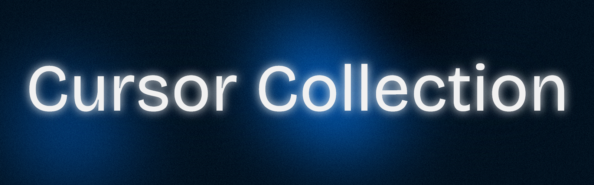

  

Enhance your desktop experience with unique and stylish pointer themes! This project is a curated collection of custom cursor packs for both Windows and Linux.

## Cursor Collection

| Cursor Name                        | Description                                                                 | Tags                        |
|------------------------------------|-----------------------------------------------------------------------------|-----------------------------|
| Acheron                            | Inspired by Acheron from Genshin Impact. Futuristic, game-themed cursors.       | Genshin Impact, Game, Themed |
| Anya Forger                        | Inspired by Anya Forger from the anime Spy x Family. Cute, anime-themed cursors. | Anime, Cute, Themed         |
| Arlechinno                         | Inspired by Arlechinno from Genshin Impact. Dramatic, game-themed cursors.      | Genshin Impact, Game, Themed |
| Camellya                           | Inspired by Camellya from Wuthering Waves. Elegant, game-themed cursors.        | Wuthering Waves, Game, Themed |
| Cantarella                         | Inspired by Cantarella from Wuthering Waves. Stylish, game-themed cursors.      | Wuthering Waves, Game, Themed |
| Carlotta                           | Inspired by Carlotta from Wuthering Waves. Unique, game-themed cursors.         | Wuthering Waves, Game, Themed |
| Carthenyia                         | Inspired by Carthenyia from Wuthering Waves. Modern, game-themed cursors.       | Wuthering Waves, Game, Themed |
| Chihiya Anon                       | Inspired by Chihiya Anon.                                                      | Anime, Themed               |
| Ciaccona                           | Inspired by Ciaccona. Artistic, themed cursors.                                 | Artistic, Themed             |
| Changli                            | Inspired by Changli from Wuthering Waves. Sleek, game-themed cursors.           | Wuthering Waves, Game, Themed |
| Cinnamon Cursors                   | Cinnamon desktop inspired. Clean, minimal cursors.                              | Linux, Minimal, Themed       |
| Cyberpunk                          | Cyberpunk inspired. Futuristic, neon-themed cursors.                            | Cyberpunk, Futuristic, Themed|
| Felyne Bow                         | Felyne with Bow. Game-themed, Monster Hunter.                                   | Monster Hunter, Game, Themed |
| Felyne Great Sword                 | Felyne with Great Sword. Game-themed, Monster Hunter.                           | Monster Hunter, Game, Themed |
| Felyne Normal (No Weapon)          | Felyne (no weapon). Game-themed, Monster Hunter.                                | Monster Hunter, Game, Themed |
| Frieren                            | Inspired by Frieren. Anime, fantasy-themed cursors.                             | Anime, Fantasy, Themed       |
| Frieren Winter                     | Inspired by Frieren (Winter). Anime, fantasy-themed cursors.                    | Anime, Fantasy, Themed       |
| Furina 2.0                         | Inspired by Furina from Genshin Impact. Modern, game-themed cursors.            | Genshin Impact, Game, Themed |
| Mauvika                            | Inspired by Mauvika from Genshin Impact. Vibrant, game-themed cursors.          | Genshin Impact, Game, Themed |
| Nezuko Cursor                      | Inspired by Nezuko from Demon Slayer. Anime, themed cursors.                     | Anime, Themed                |
| Shorekeeper                        | Inspired by Shorekeeper from Wuthering Waves. Distinct, game-themed cursors.    | Wuthering Waves, Game, Themed |
| Sousou no Frieren                  | Inspired by Sousou no Frieren. Anime, fantasy-themed cursors.                   | Anime, Fantasy, Themed       |
| Windows 11 Dark                    | Windows 11 Dark style. Minimal, modern, OS-inspired.                            | Windows, Minimal, Dark       |
| Windows 11 Light                   | Windows 11 Light style. Minimal, modern, OS-inspired.                           | Windows, Minimal, Light      |
| Zani                               | Inspired by Zani from Wuthering Waves. Artistic, game-themed cursors.           | Wuthering Waves, Game, Themed |

## Features
- A variety of custom cursor designs
- Easy installation for Windows and Linux
- Suitable for personal customization and theming

## Getting Started

### 1. Download the Cursors
Extract the contents of the desired `.zip` file (e.g., anya_forger.zip) to access the cursor files.

### 2. Installation

#### Windows
**Automated:**
1. Right-click on the `installer.inf` file (if provided).
2. Click on Install.
3. Go to `Control Panel` > `Mouse` > `Pointers` tab to select your new cursors.

**Manual:**
1. Open the extracted folder and copy the cursor files (`.cur` and `.ani`).
2. Go to `Control Panel` > `Mouse` > `Pointers` tab.
3. Select a pointer role (e.g., Normal Select), click `Browse...`, and choose your custom cursor.
4. Repeat for other pointer roles as desired.
5. Click `Save As...` to save your new cursor scheme.

#### Linux (X11, e.g., GNOME, KDE)
1. Extract the cursor theme folder to `~/.icons/` or `/usr/share/icons/`.
2. Use your desktop environment's settings to select the new cursor theme.
   - For GNOME: `gnome-tweaks` > `Appearance` > `Cursor`
   - For KDE: `System Settings` > `Cursor Theme`
3. You may need to restart your session for changes to take effect.

## Contributing
Feel free to submit your own cursor designs or improvements via pull requests!

## License
This project is open source. The cursors provided in this repository are the property of their original artists. No ownership is claimed over the content provided. Please respect the original licenses and attributions where possible.

## Credits
- Cursors are designed by various artists. Attribution is given where possible, but ownership remains with the original creators.
- Special thanks to the following artists for creating majority of the cursors featured in the repository:
    - https://vsthemes.org/en/user/BLZ/
    - https://vsthemes.org/en/user/Alliline

---

  <strong>Made with ❤️ by ctrlcat0x</strong>

 
